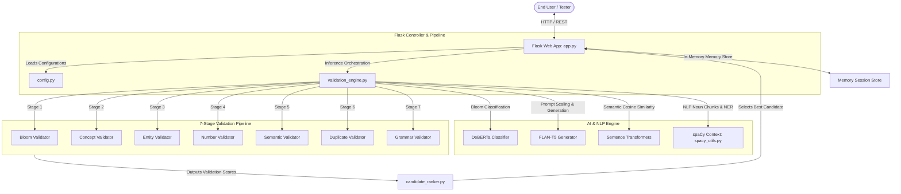

# BloomEngine

<p align="center">
  
  
  
  
  
  
  
  
</p>

---

## Overview

**BloomEngine** is a production-ready, university-grade NLP question-generation and validation pipeline. Built on top of fine-tuned transformers (FLAN-T5 for generation, DeBERTa-v3 for cognitive classification), BloomEngine transforms simple, low-cognitive-level questions (e.g., "Remember" level) into complex, higher-order questions matching specific target cognitive levels in **Bloom's Taxonomy** (e.g., "Understand", "Apply", "Analyze", "Evaluate", "Create").

The system is engineered for academic excellence, implementing a strict **7-Stage Modular NLP Validation Pipeline** to ensure that every generated question retains the core concepts and entities of the original while adhering to correct grammar, logical numbers, and high semantic similarity.

### Key Objectives
* **Taxonomic Accuracy:** 99% accuracy in target Bloom's Taxonomy category alignment.
* **Concept & Entity Preservation:** Maintain 100% of the core CS/engineering concepts and technical entities.
* **Production Reliability:** Maintain $\ge$ 88% overall validation pass rate using an adaptive scaling multi-candidate inference engine.

---

## Features

- **Bloom Classification:** Classifies incoming questions into Bloom's Taxonomy categories using a fine-tuned DeBERTa-v3 model.
- **Difficulty Classification:** Evaluates question difficulty levels (Easy, Medium, Hard).
- **Question Transformation:** Rewrites questions to higher cognitive levels using instruction-guided FLAN-T5 prompts.
- **Multi-Candidate Generation:** Generates multiple variant candidates and ranks them dynamically.
- **7-Stage Validation Pipeline:** Orchestrates sequential verification checking across NLP, semantic, duplicate, and syntactic constraints.
- **Concept Preservation:** Uses spaCy noun chunk and compound token extractors to guarantee subject matter alignment.
- **Semantic Validation:** Employs SentenceTransformers to calculate semantic cosine similarity between the source and target.
- **Duplicate Detection:** Prevents generating questions that are structurally or semantically too close to questions seen in the session history using Fuzzy Matcher and cosine distance.
- **Grammar Validation:** Applies capitalization, spacing, length, and bigram repetition filters.
- **Batch Processing:** Handles bulk imports of `.xlsx`, `.csv`, `.docx`, `.pdf`, and `.pptx` documents in the UI.
- **Analytics Dashboard:** Visualizes batch processing results, validation scores, and failure distributions.
- **Question Workspace:** Real-time interactive playground to test prompts, inspect scores, and review validation stages.
- **System Models Inspector:** View local weights configuration and verify device allocation (CPU/CUDA).

---

## Technology Stack

* **Frontend:** HTML5, CSS3, Tailwind CSS (UI styling framework), JavaScript, Chart.js (analytics graphing).
* **Backend:** Python 3.12, Flask (REST API & Server orchestration).
* **AI & NLP:**
  * **FLAN-T5:** Exclusive generation model for question variants.
  * **DeBERTa-v3:** Taxonomic classifier (Bloom categories).
  * **Sentence Transformers:** Embedding model for semantic similarity metrics.
  * **spaCy:** Linguistic processing (`en_core_web_sm` model for tokenization, compound noun extraction, and NER).
  * **RapidFuzz:** String matching and duplicate check heuristics.
  * **PyTorch & Hugging Face Transformers:** High-performance local inference.
* **Testing:** Node.js, Playwright (E2E regression & benchmark suite).

---

## Architecture

The following diagram illustrates the deployment layout and component interactions of the BloomEngine application:



---

## AI Execution Flow

The text transformations run through the following pipeline path:

```
[User Question Input] 
       ↓
[Bloom Classification (DeBERTa Classifier)]
       ↓
[Multi-Candidate Variant Generation (FLAN-T5 Model)]
       ↓
[7-Stage Validation Engine (Spacy/Embeddings Validation)]
       ↓
[Candidate Scoring & Ranking (Candidate Ranker)]
       ↓
[Final Validated Question Output]
```

---

## 7-Stage Validation Pipeline

1. **Bloom Validator:** Checks if the generated question contains verbs and structures appropriate for the target Bloom level (using keyword lists).
2. **Concept Validator:** Uses spaCy to extract noun chunks and compound nouns from the source question and ensures they are preserved in the generated output.
3. **Entity Validator:** Extracts named entities (NER) and jargon terms, verifying they are preserved without adding unnecessary technical noise.
4. **Number Validator:** Scans and matches numeric patterns, IPv4/IPv6 addresses, and specific versions to prevent hallucinated changes.
5. **Semantic Validator:** Encodes source and target questions using Sentence Transformers, validating that their semantic cosine similarity exceeds $70\%$.
6. **Duplicate Validator:** Filters out candidates that are structurally (using SequenceMatcher) or semantically too similar to questions in the session history.
7. **Grammar Validator:** Ensures length limits, checks punctuation rules, removes spacing glitches, and rejects phrase repetitions.

---

## Screenshots Section

### 1. Analytics Dashboard
*(Placeholder for Analytics Dashboard: Showing batch statistics, generation success trends, and stage score averages)*

### 2. Question Studio
*(Placeholder for Question Studio: Interface to input a question, configure target parameters, and generate/inspect candidates)*

### 3. Bulk Processing Drawer
*(Placeholder for Bulk Processing Drawer: Upload queue for Excel, PDF, and Word docs with progress bars and interactive lists)*

### 4. Validation Engine Matrix
*(Placeholder for Validation Engine Matrix: Granular breakdown of 7 validator stages, showing passes, fails, and scores)*

---

## Installation

1. **Prerequisites:** Ensure you have Python 3.10+ installed.
2. **Create Virtual Environment:**
   ```bash
   python -m venv .venv
   source .venv/bin/activate  # On Windows use: .venv\Scripts\Activate.ps1
   ```
3. **Install Python Requirements:**
   ```bash
   pip install -r requirements.txt
   ```
4. **Install spaCy Language Models:**
   ```bash
   python -m spacy download en_core_web_sm
   ```

---

## Model Setup

To keep the repository lightweight, model weights (`.safetensors` and `.bin` files) are excluded via `.gitignore`. You must set up the weights locally before launching:

1. **DeBERTa Classification Model:**
   * Create the directory `deberta_bloom_model/` in the root.
   * Make sure the tokenizer configs and `config.json` (already checked into the repository) remain in that directory.
   * Download the weights (`model.safetensors` or `pytorch_model.bin`) for your fine-tuned DeBERTa model and place them inside `deberta_bloom_model/`.

2. **FLAN-T5 Generation Model:**
   * Create the directory `flan_t5_model/` in the root.
   * Keep the configuration and vocabulary files (`config.json`, `generation_config.json`, tokenizer configurations, and `spiece.model`) tracked in that directory.
   * Download the fine-tuned generator weights (`model.safetensors` or `pytorch_model.bin`) and place them inside `flan_t5_model/`.

---

## Running the Application

Start the Flask server locally:
```bash
python app.py
```
Open [http://127.0.0.1:5000](http://127.0.0.1:5000) in your browser.

---

## Running Benchmarks

Evaluate the pipeline on the benchmark dataset to produce performance metrics:
```bash
python evaluate_pipeline.py
```

---

## Running Playwright Tests

1. **Install Node dependencies:**
   ```bash
   npm install
   npx playwright install
   ```
2. **Launch E2E Tests:**
   ```bash
   npx playwright test
   ```

---

## Repository Structure

```text
BloomAI_Arena_v2_1/
├── .github/
│   ├── ISSUE_TEMPLATE/
│   │   ├── bug_report.md
│   │   └── feature_request.md
│   └── pull_request_template.md
├── archive/                   # Legacy scripts and reports
├── before_results/           # Reference evaluation metrics
├── deberta_bloom_model/       # DeBERTa configurations (weights excluded)
├── flan_t5_model/             # FLAN-T5 configurations (weights excluded)
├── static/
│   ├── css/
│   │   └── style.css          # Core styles
│   ├── js/
│   │   └── main.js           # Client-side SPA routing and UI interactions
│   └── uploads/               # Local folder for file batch uploads
├── templates/
│   └── index.html             # Main HTML template
├── tests/
│   ├── bloom_benchmark.spec.js # Benchmark Playwright spec
│   ├── bulk_processing.spec.js # E2E bulk processor spec
│   ├── demo.csv               # Test file
│   └── demo.txt               # Test file
├── .flake8                    # Flake8 style config
├── .gitignore                 # Exclusion configuration
├── app.py                     # Flask entry point and endpoints
├── bloom_validator.py         # Taxonomic verb constraints
├── candidate_ranker.py        # Candidate scoring algorithm
├── CHANGELOG.md               # Version changes log
├── CODE_OF_CONDUCT.md         # Open-source community code of conduct
├── concept_validator.py       # spaCy concept extraction
├── config.py                  # Core hyperparameters & domain lists
├── CONTRIBUTING.md            # Guidelines for developers
├── duplicate_validator.py     # String & semantic duplicate checks
├── entity_validator.py        # spaCy NER jargon checkers
├── evaluate_pipeline.py       # Benchmark evaluation script
├── final_dataset_v2.xlsx      # CS question dataset
├── grammar_validator.py       # Syntactic checks & spacing corrections
├── LICENSE                    # MIT License details
├── number_validator.py        # Digits/IP/version extraction
├── package.json               # Node.js dependencies
├── package-lock.json
├── playwright.config.js       # Playwright runner options
├── prompt_templates.py        # Prompt styling configurations
├── requirements.txt           # Python library requirements
├── SECURITY.md                # Reporting policy details
├── semantic_validator.py      # Embedding cosine matching
├── spacy_utils.py             # Lazy spacy wrapper
├── validation_engine.py       # 7-stage validator engine
├── validation_models.py       # Dataclass definitions
├── verify_production.py       # Sequential load health checker
└── VERSION.txt                # Version manifest (2.1.0)
```

---

## Future Roadmap

- **Better Topic Detection:** Enhance zero-shot topic classification using modern lightweight classifiers.
- **Domain Understanding:** Implement knowledge graph matching to check conceptual consistency of answers.
- **Question Understanding Layer:** Introduce a question parser that maps syntactic trees for more natural phrasing.
- **More AI Models:** Integrate support for calling remote LLM endpoints (Ollama/OpenAI) as alternative backends.

---

## License

This project is licensed under the MIT License - see the [LICENSE](LICENSE) file for details.

---

## Author

* **BloomEngine Authors** - *Core development and pipeline architecture.*

---

## Acknowledgements

- Hugging Face for the PyTorch model interfaces.
- spaCy for core linguistic and named-entity recognition services.
```
