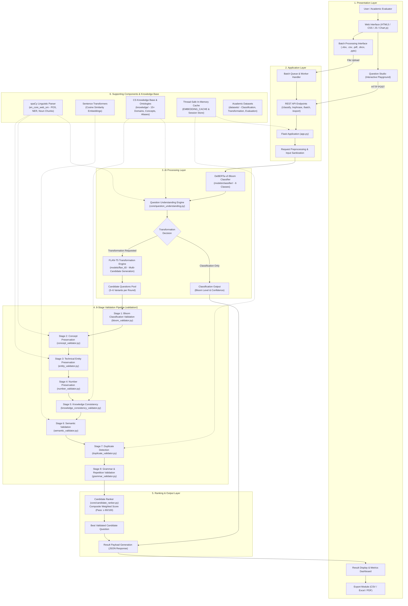

# BloomEngine

<p align="center">
  
</p>

<p align="center">
  <strong>AI-Powered Bloom's Taxonomy Question Transformation Engine</strong><br/>
  <em>MCA Major Project — Fine-Tuned NLP Pipeline for Cognitive-Level Question Generation</em>
</p>

<p align="center">
  
  
  
  
  
  
  
  
  
  
</p>

---

## Overview

**BloomEngine** is an AI question transformation and validation system developed for an MCA Major Project. It accepts academic questions in Computer Science, analyzes their cognitive level under **Bloom's Taxonomy** (*Remember, Understand, Apply, Analyze, Evaluate, Create*), and transforms them into target cognitive levels while preserving core technical concepts, entity terminology, numeric parameters, and domain-specific knowledge consistency.

The system integrates two fine-tuned transformer models with a deterministic **8-Stage NLP Validation Pipeline** to score, filter, and rank candidate outputs before presentation.

---

## System Architecture


```mermaid
graph TD
    %% Layer 1: Presentation Layer
    subgraph Layer1["1. Presentation Layer"]
        User["User / Academic Evaluator"]
        WebUI["Web Interface (HTML5 / CSS / JS / Chart.js)"]
        Studio["Question Studio (Interactive Playground)"]
        BatchUI["Batch Processing Interface (.xlsx, .csv, .pdf, .docx, .pptx)"]
        ResultView["Result Display & Metrics Dashboard"]
        ExportModule["Export Module (CSV / Excel / PDF)"]
        
        User --> WebUI
        WebUI --> Studio
        WebUI --> BatchUI
        ResultView --> ExportModule
    end

    %% Layer 2: Application Layer
    subgraph Layer2["2. Application Layer"]
        FlaskApp["Flask Application (app.py)"]
        APIRoutes["REST API Endpoints (/classify, /rephrase, /batch, /export)"]
        ReqHandler["Request Preprocessing & Input Sanitization"]
        BatchEngine["Batch Queue & Worker Handler"]
        
        Studio -->|HTTP POST| APIRoutes
        BatchUI -->|File Upload| BatchEngine
        BatchEngine --> APIRoutes
        APIRoutes --> FlaskApp
        FlaskApp --> ReqHandler
    end

    %% Layer 3: AI Processing Layer
    subgraph Layer3["3. AI Processing Layer"]
        DebertaClassifier["DeBERTa-v3 Bloom Classifier\n(models/classifier/ - 6 Classes)"]
        QEngine["Question Understanding Engine\n(core/question_understanding.py)"]
        Decision{"Transformation\nDecision"}
        FlanGenerator["FLAN-T5 Transformation Engine\n(models/flan_t5/ - Multi-Candidate Generation)"]
        CandidatePool["Candidate Questions Pool\n(3–6 Variants per Round)"]
        
        ReqHandler --> DebertaClassifier
        DebertaClassifier --> QEngine
        QEngine --> Decision
        
        Decision -->|Classification Only| DirectResult["Classification Output\n(Bloom Level & Confidence)"]
        Decision -->|Transformation Requested| FlanGenerator
        FlanGenerator --> CandidatePool
    end

    %% Layer 4: Validation Layer
    subgraph Layer4["4. 8-Stage Validation Pipeline (validation/)"]
        direction TB
        V1["Stage 1: Bloom Classification Validation (bloom_validator.py)"]
        V2["Stage 2: Concept Preservation (concept_validator.py)"]
        V3["Stage 3: Technical Entity Preservation (entity_validator.py)"]
        V4["Stage 4: Number Preservation (number_validator.py)"]
        V5["Stage 5: Knowledge Consistency (knowledge_consistency_validator.py)"]
        V6["Stage 6: Semantic Validation (semantic_validator.py)"]
        V7["Stage 7: Duplicate Detection (duplicate_validator.py)"]
        V8["Stage 8: Grammar & Repetition Validation (grammar_validator.py)"]
        
        CandidatePool --> V1
        V1 --> V2 --> V3 --> V4 --> V5 --> V6 --> V7 --> V8
    end

    %% Layer 5: Ranking and Output Layer
    subgraph Layer5["5. Ranking & Output Layer"]
        Ranker["Candidate Ranker (core/candidate_ranker.py)\nComposite Weighted Score (Pass: ≥ 80/100)"]
        BestCandidate["Best Validated Candidate Question"]
        ResultGen["Result Payload Generation (JSON Response)"]
        
        V8 --> Ranker
        Ranker --> BestCandidate
        BestCandidate --> ResultGen
        DirectResult --> ResultGen
        ResultGen --> ResultView
    end

    %% Layer 6: Supporting Components
    subgraph Layer6["6. Supporting Components & Knowledge Base"]
        SpacyNLP["spaCy Linguistic Parser\n(en_core_web_sm - POS, NER, Noun Chunks)"]
        SentenceTransformers["Sentence Transformers\n(Cosine Similarity Embeddings)"]
        KnowledgeOntology["CS Knowledge Base & Ontologies\n(knowledge/ - 15+ Domains, Concepts, Aliases)"]
        MemoryCache["Thread-Safe In-Memory Cache\n(EMBEDDING_CACHE & Session Store)"]
        Datasets["Academic Datasets\n(datasets/ - Classification, Transformation, Evaluation)"]
        
        SpacyNLP -.-> QEngine
        SpacyNLP -.-> V2
        SpacyNLP -.-> V3
        SentenceTransformers -.-> V6
        KnowledgeOntology -.-> QEngine
        KnowledgeOntology -.-> V5
        MemoryCache -.-> FlaskApp
        MemoryCache -.-> V7
    end
```

---

### Architecture Flow

1. **Input Submission**: The user submits an academic question via the interactive Question Studio or uploads batch files (`.xlsx`, `.csv`, `.pdf`, `.docx`, `.pptx`).
2. **Request Routing**: Flask application routes the payload through `/classify`, `/rephrase`, or `/batch` endpoints.
3. **Preprocessing**: Input text undergoes normalization, whitespace sanitization, and token preparation.
4. **Bloom Classification**: Fine-tuned DeBERTa-v3 predicts the source Bloom's Taxonomy cognitive level and difficulty.
5. **Question Understanding**: The Question Understanding Engine analyzes syntactic structure, identifies the Computer Science domain, extracts core subject concepts, and checks canonical ontologies.
6. **Candidate Generation**: If transformation is requested, fine-tuned FLAN-T5 generates multiple candidate variants for the selected target Bloom level.
7. **8-Stage Validation Pipeline**: Generated candidates are evaluated sequentially across Bloom verb compliance, concept preservation, entity preservation, number integrity, knowledge consistency, semantic similarity, duplicate detection, and grammar.
8. **Candidate Ranking**: The Candidate Ranker computes a composite score (out of 100) and selects the highest-scoring candidate meeting the pass threshold ($\ge 80$).
9. **Display & Export**: The final validated question and stage-by-stage audit breakdown are returned to the user interface with options to export as CSV, Excel, or PDF.

---

### End-to-End Processing Flow

```text
Question Input
      ↓
Input Processing
      ↓
DeBERTa-v3 Classification
      ↓
Question Understanding
      ↓
Target Bloom Selection
      ↓
FLAN-T5 Candidate Generation
      ↓
8-Stage Validation
      ↓
Candidate Ranking
      ↓
Final Validated Question
      ↓
Display / Export
```

---

## AI Model Pipeline

| Component | Model / Technology | Purpose |
|---|---|---|
| **Bloom Classification** | Fine-tuned DeBERTa-v3 | Classifies questions into six Bloom's Taxonomy cognitive levels |
| **Question Transformation** | Fine-tuned FLAN-T5 | Generates candidate questions at the requested target Bloom level |
| **Semantic Validation** | Sentence Transformers | Computes semantic cosine similarity between source and target questions |
| **Linguistic Processing** | spaCy (`en_core_web_sm`) | Performs tokenization, POS tagging, noun chunk extraction, and NER |
| **Duplicate Matching** | RapidFuzz / SequenceMatcher | Detects near-duplicate outputs against session history |

---

## Validation Pipeline

| Stage | Validation | Purpose |
|---|---|---|
| 1 | **Bloom Classification** | Verifies that the candidate uses appropriate action verbs and structure for the target cognitive level |
| 2 | **Concept Preservation** | Ensures all core subject matter noun chunks from the source question appear in the output |
| 3 | **Technical Entity Preservation** | Protects domain-specific terms (e.g., SQL, TCP, IPv4, AES, Deadlock) from distortion |
| 4 | **Number Preservation** | Confirms numeric parameters, IP addresses, bit lengths, and version standards remain intact |
| 5 | **Knowledge Consistency** | Validates concept graph alignment and penalizes out-of-domain concept drift |
| 6 | **Semantic Validation** | Verifies that SentenceTransformer cosine similarity between source and candidate satisfies threshold ($\ge 0.70$) |
| 7 | **Duplicate Detection** | Blocks candidates structurally or semantically too similar to recent session history |
| 8 | **Grammar & Repetition** | Validates capitalization, punctuation, length bounds, and flags unnatural phrase repetition |

**Scoring Weights (`config.py`):**

```text
Bloom Level Match      : 35 pts    |    Knowledge Consistency : 20 pts
Topic Preservation     : 15 pts    |    Concept Preservation  : 10 pts
Technical Entities     : 10 pts    |    Number Integrity      :  5 pts
Grammar & Formatting   :  3 pts    |    Duplicate Penalty     :  2 pts
────────────────────────────────────────────────────────────────────────
Total                  : 100 pts   |    Passing Threshold     : 80 pts
```

---

## Project Architecture

```text
BloomAI_Arena_v2_1/
├── app.py                     # Flask application entry point and REST API routes
├── config.py                  # System hyperparameters, thresholds, and scoring weights
├── requirements.txt           # Python dependency specifications
├── playwright.config.js       # Playwright E2E testing configuration
│
├── models/                    # Fine-tuned model directories (weights tracked via Git LFS)
│   ├── classifier/            # DeBERTa-v3 sequence classification model and tokenizer
│   └── flan_t5/               # FLAN-T5 seq2seq generation model and tokenizer
│
├── core/                      # Core question processing modules
│   ├── question_understanding.py   # Domain inference and concept extraction engine
│   ├── question_profile.py         # Question representation data models
│   ├── candidate_ranker.py         # Multi-candidate scoring and ranking logic
│   ├── spacy_utils.py              # spaCy integration and embedding cache management
│   ├── prompt_templates.py         # FLAN-T5 instruction prompt construction
│   ├── retry_context.py            # Adaptive feedback and retry advisor
│   ├── pipeline_context.py         # Execution state tracker
│   └── domain_hierarchy_builder.py # Subject and topic hierarchy indexing
│
├── validation/                # 8-Stage NLP validation pipeline
│   ├── validation_engine.py   # Validation pipeline orchestrator
│   ├── bloom_validator.py     # Stage 1: Bloom verb profiling
│   ├── concept_validator.py   # Stage 2: Noun chunk preservation
│   ├── entity_validator.py    # Stage 3: Technical entity preservation
│   ├── number_validator.py    # Stage 4: Number and protocol preservation
│   ├── knowledge_consistency_validator.py # Stage 5: Knowledge graph consistency
│   ├── semantic_validator.py  # Stage 6: Cosine similarity validation
│   ├── duplicate_validator.py # Stage 7: Duplicate detection
│   ├── grammar_validator.py   # Stage 8: Syntax and repetition checks
│   ├── topic_validator.py     # Topic preservation verification
│   └── validation_models.py   # Structured validation response dataclasses
│
├── knowledge/                 # Computer Science ontologies and domain dictionaries
│   ├── concepts.py            # Academic concepts and synonym maps
│   ├── domains.py             # Domain keyword definitions (15+ CS domains)
│   ├── terminology.py         # Technical terminology and abbreviation mappings
│   ├── hierarchy.py           # Subject-topic hierarchy trees
│   ├── topics.py              # Canonical topic mappings
│   └── generation_context.py  # Context prompts for generation
│
├── datasets/                  # Training, transformation, and benchmark data
│   ├── classification/        # 31,310 record DeBERTa training dataset (final_dataset_v2.xlsx)
│   ├── transformation/        # 21,004 pair FLAN-T5 training dataset (combined_cleaned.json)
│   └── evaluation/            # 100-item & 300-item benchmark evaluation datasets & manual_review.csv
│
├── notebooks/                 # Model training and fine-tuning Jupyter notebooks
│   ├── class.ipynb            # DeBERTa-v3 fine-tuning workflow
│   └── FFlan.ipynb            # FLAN-T5 fine-tuning workflow
│
├── evaluation/                # Benchmarking and QA audit suite
│   ├── evaluate_pipeline.py   # Automated pipeline benchmark runner
│   ├── benchmark_understanding.py # Question understanding benchmark
│   ├── benchmark_report.md    # Benchmark results and empirical findings
│   ├── bloomengine_qa_report.md   # QA test execution report
│   └── bloomengine_bug_list.csv   # QA issue tracking matrix
│
├── tests/                     # Automated test suite (Python unit tests & Playwright E2E)
│   ├── test_question_understanding.py
│   ├── test_knowledge_consistency.py
│   ├── test_retry_context.py
│   ├── test_canonical_concepts.py
│   ├── test_fallback_ui.py
│   ├── test_supplements_merged.py
│   ├── test_technical_terminology.py
│   ├── test_debug.py
│   ├── verify_production.py
│   ├── bulk_processing.spec.js
│   ├── exploratory_audit.spec.js
│   ├── batch_processing_regression.spec.js
│   ├── bloom_benchmark.spec.js
│   └── pagination_layout.spec.js
│
├── report/                    # Major Project documentation and generated figures
│   ├── BloomEngine_MCA_Major_Project_Report.docx
│   ├── BloomEngine_MCA_Major_Project_Report.md
│   └── figures/               # Architectural diagrams, confusion matrices, loss curves
│
├── templates/                 # Frontend HTML templates (Jinja2)
├── static/                    # Frontend stylesheets, JavaScript modules, and assets
└── archive/                   # Project history and development utilities archive
```

---

## Key Metrics

| Metric | Value |
|---|---|
| **Classification Dataset Size** | 31,310 questions |
| **Transformation Dataset Size** | 21,004 question pairs |
| **Benchmark Evaluation Dataset** | 300 curated questions |
| **Python Unit Tests** | 36 / 36 passed |
| **Production Verification Checks** | 6 / 6 passed |
| **Validation Pipeline Stages** | 8 stages |
| **Supported Bloom Levels** | Remember, Understand, Apply, Analyze, Evaluate, Create |
| **Pipeline Version** | v2.1.0 |

---

## Installation & Setup

### Prerequisites

- Python 3.10+ (tested on Python 3.12)
- Git & Git LFS
- Node.js 18+ (for Playwright E2E tests)

### 1. Clone the Repository

```bash
git clone https://github.com/Tharunkumar0910/BloomEngine.git
cd BloomEngine
git lfs pull
```

### 2. Create Virtual Environment

```bash
# Windows
python -m venv .venv
.venv\Scripts\Activate.ps1

# Linux / macOS
python3 -m venv .venv
source .venv/bin/activate
```

### 3. Install Dependencies

```bash
pip install -r requirements.txt
python -m spacy download en_core_web_sm
```

---

## Running the Application

Start the local Flask development server:

```bash
python app.py
```

Access the interface at **http://127.0.0.1:5000** in your browser.

### API Endpoints

| Endpoint | Method | Description |
|---|---|---|
| `/health` | GET | Returns server health status and loaded model states |
| `/classify` | POST | Classifies input question into Bloom's Taxonomy cognitive level |
| `/rephrase` | POST | Transforms question to target Bloom level with 8-stage validation |
| `/batch` | POST | Processes bulk question files (`.xlsx`, `.csv`, `.docx`, `.pdf`, `.pptx`) |
| `/export` | POST | Exports transformation results in CSV, Excel, or PDF formats |
| `/api/models/status` | GET | Returns inference device and model memory statistics |

---

## Running Tests & Verification

### Unit Test Suite

```bash
pytest tests/ -v
```

### Production Verification Suite

```bash
python tests/verify_production.py
```

### Pipeline Benchmark

```bash
python evaluation/evaluate_pipeline.py
```

### Playwright E2E Tests

```bash
npm install
npx playwright install
npx playwright test
```

---

## Supported Computer Science Domains

The ontology covers 15+ academic Computer Science domains:
- **Database Management Systems** (SQL, Normalization, Transactions, ACID, NoSQL)
- **Computer Networks** (TCP/UDP, OSI Model, IPv4/IPv6, HTTP/HTTPS, Routing)
- **Operating Systems** (Processes, Threads, CPU Scheduling, Deadlocks, Virtual Memory)
- **Data Structures & Algorithms** (Trees, Graphs, Sorting, Dynamic Programming)
- **Machine Learning & Artificial Intelligence** (Classification, Regression, Neural Networks, Search)
- **Software Engineering** (SDLC, Design Patterns, Testing, Agile)
- **Cyber Security & Cryptography** (Encryption, Hashes, Authentication, Firewalls)
- **Computer Architecture & Organization** (Pipelining, Cache, Instruction Sets)

---

## License

This project is licensed under the **MIT License** — see the [LICENSE](LICENSE) file for details.

---

## Author

**Tharun Kumar**  
MCA Major Project  
GitHub: [@Tharunkumar0910](https://github.com/Tharunkumar0910)
