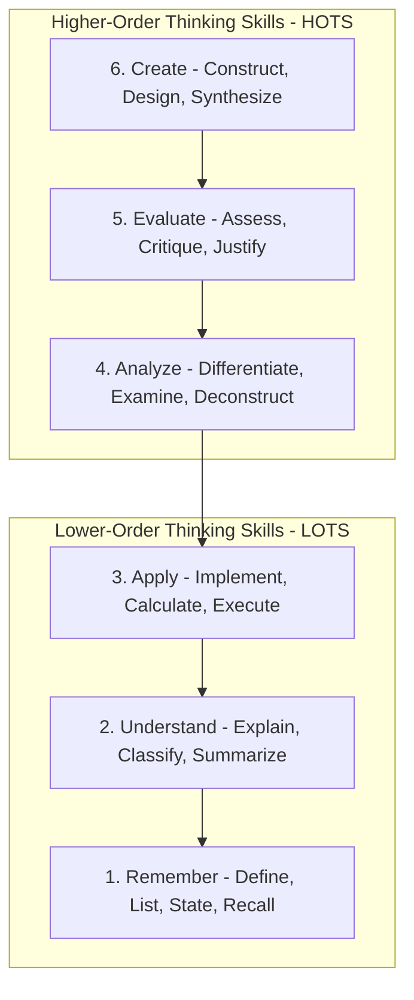
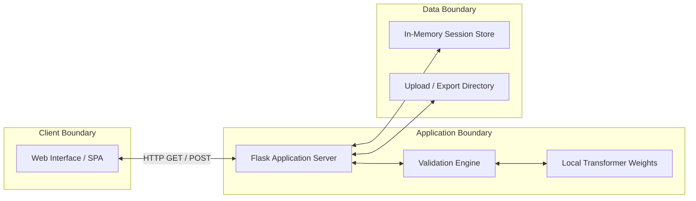

# CHAPTER 1: INTRODUCTION

---

## 1.1 Introduction to the Project

In modern higher education, particularly within Computer Science and Engineering disciplines, the design of evaluation instruments plays a pivotal role in measuring student learning outcomes. Traditional academic assessment methodologies often rely heavily on lower-order cognitive questioning—such as factual recall, direct definitions, and basic conceptual explanations. While foundational knowledge is essential, assessing higher-order cognitive capabilities such as problem analysis, algorithmic design, critical evaluation, and system synthesis is critical for preparing graduates for complex industry requirements.

Benjamin Bloom’s Taxonomy of Educational Objectives, revised by Anderson and Krathwohl in 2001, provides a structured framework for categorizing cognitive learning objectives into six distinct levels:
1. **Remember**: Retrieving relevant knowledge from long-term memory.
2. **Understand**: Constructing meaning from instructional messages and explanations.
3. **Apply**: Carrying out or using a procedure in a given situation.
4. **Analyze**: Breaking material into constituent parts and determining how parts relate to one another and to an overall structure.
5. **Evaluate**: Making judgments based on criteria and standards.
6. **Create**: Putting elements together to form a coherent or functional whole, or reorganizing elements into a new pattern or structure.

*Figure 1.1: Anderson and Krathwohl's Revised Bloom’s Taxonomy Hierarchy.*

Manually reformulating existing lower-order questions into higher-order cognitive questions requires significant domain expertise, substantial temporal investment, and rigorous editorial oversight. Educators frequently encounter challenges in maintaining core subject-matter concepts, technical entity definitions, and logical constraints when attempting to elevate question difficulty.

To address these limitations, this major project introduces **BloomEngine**—an AI-powered Bloom Taxonomy Classification and Difficulty-Aware Question Transformation System. BloomEngine integrates specialized fine-tuned transformer architectures, linguistic parsing engines, and a multi-stage validation pipeline to automate the transformation of low-cognitive assessment items into robust, high-cognitive assessment questions.

The core architecture combines:
* **DeBERTa-v3**: A fine-tuned sequence classification model trained on 30,000 domain-specific questions to accurately categorize items into Bloom's Taxonomy cognitive levels and difficulty tiers.
* **FLAN-T5**: An instruction-tuned sequence-to-sequence generation model trained on 20,000 transformation pairs to perform target-directed cognitive elevation.
* **spaCy & SentenceTransformers**: Natural Language Processing (NLP) modules for compound noun extraction, named-entity preservation, and vector embedding similarity measurement.
* **Multi-Stage Validation Pipeline**: A modular verification engine enforcing concept retention, technical entity preservation, numerical constraint verification, domain consistency, duplicate filtering, and syntactic grammar checking.

---

## 1.2 Statement of the Problem

The automated generation of educational questions using unconstrained language models introduces several critical failure modes that prevent direct adoption in formal academic environments:

1. **Predominance of Lower-Order Questioning**: Academic test banks are disproportionately populated with recall-based questions (*Remember* and *Understand* levels). Manually re-engineering thousands of questions to higher cognitive levels (*Analyze*, *Evaluate*, *Create*) is computationally and labor-intensively inefficient for academic institutions.
2. **Concept Drift and Information Loss**: Generic text-rewriting models frequently alter or drop essential Computer Science concepts (e.g., replacing "B-Tree indexing" with generic "file searching"), rendering transformed questions technically invalid or irrelevant to the syllabus.
3. **Entity and Numeric Hallucination**: Automated text transformers tend to mutate specific technical constants, IP addresses, mathematical formulas, or domain entities, leading to factual inaccuracy.
4. **Lack of Taxonomic Control**: Off-the-shelf generative models lack explicit fine-grained control over specific Bloom cognitive targets, often producing questions that match unintended cognitive levels or inconsistent difficulty tiers.
5. **Absence of Quantitative Quality Control**: Existing question creation workflows lack automated, multi-stage verification steps to validate syntax, semantic preservation, and non-duplication prior to exam inclusion.

BloomEngine resolves these challenges by coupling fine-tuned seq2seq generation with a multi-candidate ranking algorithm and a strict multi-stage NLP validation engine. This guarantees that every transformed question retains the key concepts of the original item while adhering strictly to the desired Bloom cognitive level.

---

## 1.3 System Specifications

The execution of BloomEngine involves model fine-tuning, local transformer inference, vector embedding calculations, and a web-based user interface. The detailed hardware, software, and operational specifications are outlined below.

### 1.3.1 Hardware Specifications

The hardware environment must support local model loading, GPU-accelerated tensor computations, and efficient memory management during multi-candidate generation.

*Table 1.1: Hardware Specifications.*

| Component | Minimum Specification | Recommended Specification |
| :--- | :--- | :--- |
| **Processor (CPU)** | Intel Core i5 / AMD Ryzen 5 (4 Cores, 2.5 GHz) | Intel Core i7 / AMD Ryzen 7 (8 Cores, 3.5 GHz+) |
| **System Memory (RAM)** | 16 GB DDR4 | 32 GB DDR4 / DDR5 |
| **Graphics Processing Unit (GPU)** | NVIDIA GTX 1660 (6 GB VRAM) | NVIDIA RTX 3080 / RTX 4080 (10 GB+ VRAM, CUDA support) |
| **Storage Space** | 25 GB Available Solid-State Drive (SSD) | 50 GB NVMe M.2 SSD |
| **Display Resolution** | $1366 \times 768$ pixels | $1920 \times 1080$ pixels (Full HD) |

### 1.3.2 Software & Framework Specifications

The software stack relies on open-source Python libraries, Hugging Face transformers, PyTorch, spaCy, and Web technologies.

*Table 1.2: Software Specifications.*

| Software / Dependency | Version | Primary Function |
| :--- | :--- | :--- |
| **Operating System** | Windows 10 / 11, Linux (Ubuntu 22.04 LTS), macOS | Host Operating System |
| **Runtime Environment** | Python 3.10 / 3.11 / 3.12 | Primary execution language |
| **Web Framework** | Flask 3.0.x | Backend REST API server and route orchestration |
| **Machine Learning Framework**| PyTorch 2.x | Tensor computation backend for local transformers |
| **Transformer Library** | Hugging Face Transformers 4.x | Tokenizer and model loader for DeBERTa and FLAN-T5 |
| **Sequence Generation** | Fine-Tuned FLAN-T5 (`flan_t5_model`) | Question transformation seq2seq generator |
| **Cognitive Classification** | Fine-Tuned DeBERTa-v3 (`deberta_bloom_model`) | Bloom's Taxonomy sequence classifier |
| **Sentence Embeddings** | SentenceTransformers (`all-MiniLM-L6-v2`)| Vector encoding for semantic similarity scoring |
| **NLP & Linguistic Parsing** | spaCy 3.x (`en_core_web_sm`) | POS tagging, compound noun chunking, NER |
| **String & Duplicate Engine** | RapidFuzz | Fuzzy string matching and duplicate ratio calculation |
| **Document Processing** | Pandas, OpenPyXL, PyPDF2, docx, pptx, FPDF2 | Multi-format bulk file ingestion and export generation |
| **Frontend Stack** | HTML5, CSS3, Tailwind CSS, JavaScript | Interactive Single-Page Application UI |
| **Visualization Engine** | Chart.js 4.x | Real-time analytics dashboard charts |
| **End-to-End Testing** | Playwright (Node.js) | E2E functional and benchmark testing |

### 1.3.3 System Boundary & Operational Environment

BloomEngine operates as a localized Flask web application where user requests interact with backend model execution threads through defined REST endpoints.

*Figure 1.2: System Boundary and Operational Architecture.*

Models are initialized during application startup to reduce inference latency and prevent thread contention. The system operates locally without external API dependencies, maintaining total data privacy for academic evaluation items.
